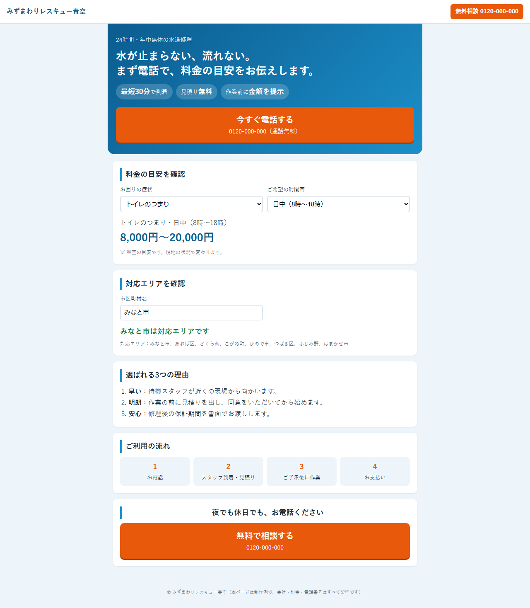
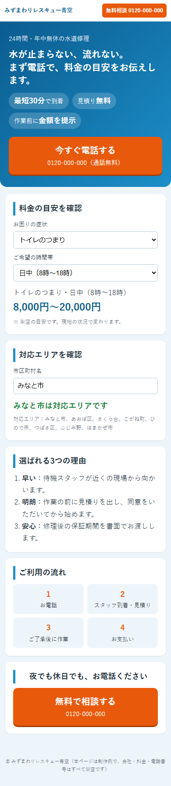

# 水道修理の広告LP（料金目安つき）

検索広告から来た人が数秒で「いくらか」「来てくれるか」を判断できる、1ページ完結のLPの試作です。会社名・電話番号・料金・対応エリアはすべて架空です。AI は使っていません。

## このPOCで確かめたこと
- 症状と時間帯から料金の目安（下限〜上限）を出せる。日中は基本の範囲、夕方・夜は1,500円、深夜・早朝は4,000円が下限・上限の両方に加算される。
- 市区町村名を入れると、対応エリアかどうかを即座に表示できる（前後の空白は無視、空欄は対応不可扱い）。
- 開いた直後から、料金の目安と対応エリアの判定結果が画面に出ている。
- ページに電話ボタン（`tel:`）と、料金・エリアの区画があり、外部のURLを読み込んでいない。

`npm test` でこれらを確認できます。

## 作っていない範囲
- 実際の写真の組み込み（画像は使っていない）
- 広告計測タグ、問い合わせフォーム送信
- 複数パターンのA/Bテスト
- 実在業者の情報・実際の料金

## 次の進め方
1. 実際の訴求（強み・料金体系・対応エリア）と用意された写真をいただく。
2. 写真を入れてファーストビューの見出しと電話ボタンの位置を調整する。
3. 広告の流入元ごとに見出しを変えた版を作り、反応を比べる。

## 動かし方
- 画面: `docs/index.html` をブラウザで開く。
- テスト: `npm install` のあと `npm test`
